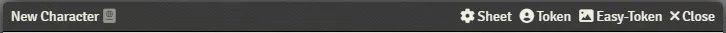

# FoundryVTT Easy Token

Adds a fast and easy way to create, save and update a token image using the foundry's renderer engine.

A new option will appear in the header of an actor sheet (if the user has the required permissions) which will open a token editor.

## Load Image

To load an image in the editor you can:

-   Drag & drop the image from your computer.

-   Drag & drop an image from a website. If nothing appears, it means that the server hosting the image does not allow CORS, simply save the image on your computer to use it.

-   `Open Local Image` which is the same as the drag & drop from your computer.

-   `Open Server Image` which allows loading images from the server (requires permission).

-   `Load Avatar Image` will simply load the current actor's avatar in the editor.

## Create Token Image

Once an image is loaded, you can move it, zoom in & out and change the token's border and background colors with the color pickers.

The result is shown live in the preview square bottom right of the editor.

## Saving Images

Once done, you can use any of the following options:

-   `Save Avatar Image` will encode and upload the current image used in the editor to the server, it will also automatically set the actor's avatar.

-   `Save Token Image` will encode and upload the previewed token image to the server, it will also update the token image of the prototype and all the tokens already present in the world **IF** they are linked to the actor.

-   `Save All & Close` will do both and close the editor.

_The images are encoded in `webp` which is an [extremely light format](https://en.wikipedia.org/wiki/WebP) supported by all browsers._

## Settings

Files are uploaded to the server according to the settings in the `Directories` menu of the module, each actor type has an avatar and token path that is editable.

A default path is provided for each one in the form of:

-   for `data` "worlds/[world-id]/images/[avatar or token]s/[actor-type]s".

-   for `s3` "images/[avatar or token]s/[actor-type]s"

## Notes

-   When a change is made for a token that is not linked to any actor (such as an NPC token in a scene), the changes will only be made to this token.

-   When a change is made to an actor in the actors tab or a token that is linked to an actor, then the token prototype and all the tokens in all the scenes that are also linked to that actor will be updated.

-   Therefore, if changes are made to an actor in the actors tab that has no linked token (such as an NPC), the changes will not be reflected to the tokens already in place in the world.
